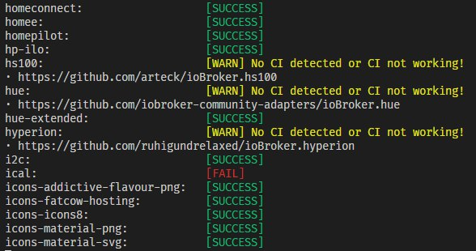

# ioBroker Repo Status

Execute this with
```bash
npx iobroker-repo-status --token=<your-github-token>
```

You can add a filter by using grep for an specific adapter, example :
```bash
npx iobroker-repo-status --token=<your-github-token> | grep 'js-controller'
```

Or an multi grep for multiple adapters, example:
```bash
npx iobroker-repo-status --token=<your-github-token> | grep 'js-controller\|admin\|web'
```

and get a quick overview over the CI status of all ioBroker adapters in the latest repo:



---

The current build status (updated daily at 1 AM and 1 PM can be seen in issue [#2](https://github.com/AlCalzone/ioBroker-repo-status/issues/2).

---
